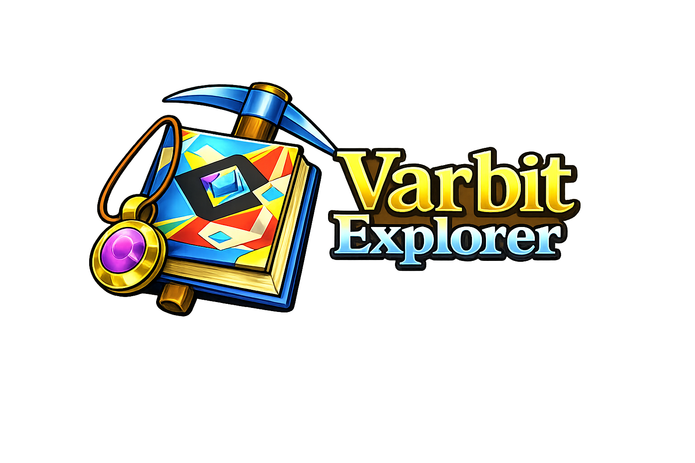
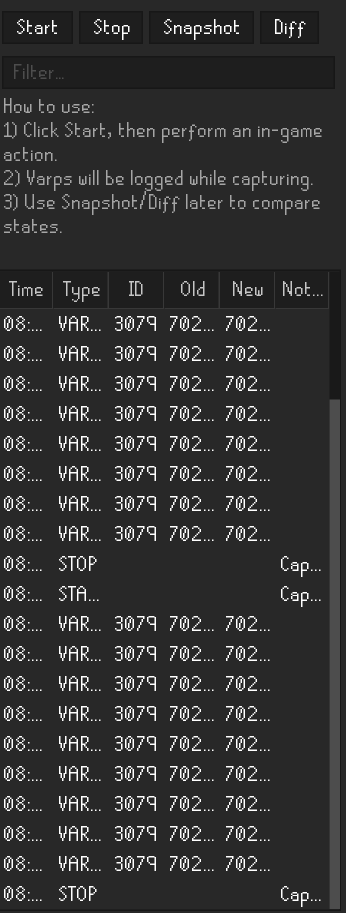

# Varbit Explorer

Varbit Explorer is a restrained RuneLite plugin for observing variable and varbit state changes in Old School RuneScape.

It focuses on visibility and inspection rather than automation.  
It does not interpret game mechanics, infer intent, or prescribe workflows.  
It exposes raw state changes and leaves meaning to the developer.

---

## Event Log Panel

The panel presents a live, chronological log of varp and varbit change events observed from the client.

Each entry is recorded as:

- Variable identifier
- Previous value
- New value
- Timestamp (client-side)

No aggregation or transformation is applied beyond formatting for readability.

---

## Purpose

Varbit Explorer exists to make invisible client state transitions visible.

It is intended for:

- Plugin development
- Reverse engineering client behaviour
- Investigating game state transitions
- Supporting inference engine development
- Observing patch, interface, or interaction-driven changes

It is not a gameplay assistant.

---

## Design Principles

- Local observation only  
- No external data authority  
- No interpretation layer  
- No inferred meaning  
- No optimization suggestions  
- No automation hooks  

All output is derived from client-observed state changes.  
No claims are made about semantic correctness of individual variables.

---

## Core Features

- Live varp change logging
- Live varbit change logging
- Chronological event stream
- Lightweight panel surface
- No persistence beyond session
- No mutation of client state

---

## Current Scope

Implemented:

- Real-time varp and varbit change logging
- Basic structured event output
- Panel surface for inspection

Not implemented:

- Filtering UI
- Search
- Persistence
- Export tooling
- Interpretation or labeling of variable meaning
- Cross-session comparison
- Aggregation or analytics
- Cloud or shared state

Varbit Explorer is an inspection tool.  
It exposes signals. It does not explain them.

---

## Relationship to the Ecosystem

Varbit Explorer exists to support development and understanding across the RuneLite Ecosystem.

It may inform:

- Inference engines
- Patch state tracking
- Interface state auditing
- Event timing validation

It does not become a central authority over data.  
Client-side state remains the source of truth.

---

## Stability & Intent

The goal is clarity, not completeness.

Growth is optional.  
Durability is preferred.  
Interpretation layers, if ever added, must remain explicitly separate from raw observation.

